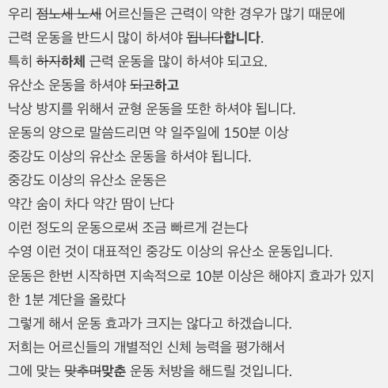

# 개요
동영상 파일로 퀴즈를 생성한다.

<br>

OpenAI의 whisper를 사용하여 동영상 파일에서 자막을 추출하고, OpenAI API를 사용하여 그 자막을 교정한다. 그리고 교정된 자막을 가지고 역시 OpenAI API를 사용하여 내용에 맞는 퀴즈를 생성한다.

<br>

# 전체적인 과정
- OpenAI whisper를 사용하여 동영상 mp4 파일에서 자막 추출
- OpenAI API를 호출하여 자막 교정
- OpenAI API를 사용하여 퀴즈 생성

<br>

# 환경 준비

ubuntu환경이며, python이 설치되어 있어야 하고, 이외에 openai, openai-whisper 모듈과 동영상 처리하리하기 위한 ffmpeg를 설치해야 한다.

```bash
$ pip install openai
$ pip install -U openai-whisper

$ sudo apt update
$ sudo apt install ffmpeg
```

OpenAI에 계정을 만들고 API key를 먼저 만들어야 한다. 그 key값을 다음 방법으로 환경변수에 설정.
```bash
$ export OPENAI_API_KEY=sk-xxxxx
```

<br>

# 실행 방법

## 자막 추출

```bash
$ whisper sample1.mp4 --output_format=txt --language=Korean
```
실행하면 sample1.txt 파일이 생긴다.

```
우리 점노세 노세 어르신들은 근력이 약한 경우가 많기 때문에
근력 운동을 반드시 많이 하셔야 됩니다.
특히 하지 근력 운동을 많이 하셔야 되고요.
유산소 운동을 하셔야 되고
낙상 방지를 위해서 균형 운동을 또한 하셔야 됩니다.
운동의 양으로 말씀드리면 약 일주일에 150분 이상
중강도 이상의 유산소 운동을 하셔야 됩니다.
중강도 이상의 유산소 운동은
약간 숨이 차다 약간 땀이 난다
이런 정도의 운동으로써 조금 빠르게 걷는다
수영 이런 것이 대표적인 중강도 이상의 유산소 운동입니다.
운동은 한번 시작하면 지속적으로 10분 이상은 해야지 효과가 있지
한 1분 계단을 올랐다
그렇게 해서 운동 효과가 크지는 않다고 하겠습니다.
저희는 어르신들의 개별적인 신체 능력을 평가해서
그에 맞는 맞추며 운동 처방을 해드릴 것입니다.
```


## 자막 교정
```bash
$ python openai_request.py sample1.txt "{any text}\n\n위의 Voice To Text 결과를 상황과 내용에 맞게 일부 잘못 인식된 글자와 문자를 보다 화자가 실제로 말했을 것 같은 내용으로 교정해라 (원본과 같은 줄바꿈을 사용해서)"
```

교정된 결과
```
우리 어르신들은 근력이 약한 경우가 많기 때문에
근력 운동을 반드시 많이 하셔야 합니다.
특히 하체 근력 운동을 많이 하셔야 하고요.
유산소 운동을 하셔야 하고
낙상 방지를 위해서 균형 운동을 또한 하셔야 합니다.
운동의 양으로 말씀드리면 약 일주일에 150분 이상
중강도 이상의 유산소 운동을 하셔야 합니다.
중강도 이상의 유산소 운동은
약간 숨이 차고 약간 땀이 난다
이런 정도의 운동으로써 조금 빠르게 걷기나
수영 이런 것이 대표적인 중강도 이상의 유산소 운동입니다.
운동은 한번 시작하면 지속적으로 10분 이상은 해야지 효과가 있지
한 1분 계단을 올랐다
그렇게 해서 운동 효과가 크지는 않다고 하겠습니다.
저희는 어르신들의 개별적인 신체 능력을 평가해서
그에 맞는 맞춤형 운동 처방을 해드릴 것입니다.
```

위 내용을 파일 sample1-revised.txt로 수동으로 저장한다.


수정된 부분



<br>

# 퀴즈 생성

```bash
$ python openai_request.py sample1-revised.txt "{any text}\n\n위의 교육 영상의 자막을 보고, 시청자가 교육 내용을 잘 이해했는지 확인하기 위한 퀴즈를 3개를 만들어줘. 일반 텍스트로 (답변 포함)"
```

생성 예
```
1. 어르신들이 주로 강화해야 할 근력 부위는 어디인가요?
   - 하체

2. 중강도 이상의 유산소 운동을 할 때, 어떤 신체적 변화를 느껴야 적절한 강도로 운동하고 있다고 볼 수 있나요?
   - 약간 숨이 차고 약간 땀이 난다

3. 어르신들의 운동 효과를 높이기 위해 한 번의 운동 세션은 최소 몇 분 이상 지속되어야 하나요?
   - 10분 이상
```

<br>

조금더 쉬운 퀴즈로

```bash
$ python openai_request.py sample1-revised.txt "{any text}\n\n위의 교육 영상의 자막을 보고, 시청자가 교육 내용을 잘 이해했는지 확인하기 위한 퀴즈를 3개를 만들어줘. 어르신들도 풀수 있는 쉬운 걸로. 일반 텍스트로 (답변 포함)"
```

생성 예
```
1. 어르신들이 일주일에 해야 하는 중강도 이상의 유산소 운동 시간은 몇 분 이상인가요?
   - A) 100분 이상
   - B) 150분 이상
   - C) 200분 이상
   - D) 250분 이상
   - 정답: B) 150분 이상

2. 중강도 이상의 유산소 운동을 할 때의 몸 상태로 알맞은 설명은 무엇인가요?
   - A) 숨이 많이 차고 많은 땀이 난다
   - B) 숨이 조금 차고 약간 땀이 난다
   - C) 전혀 숨이 차지 않고 땀이 나지 않는다
   - D) 숨이 조금 차지만 땀이 전혀 나지 않는다
   - 정답: B) 숨이 조금 차고 약간 땀이 난다

3. 운동을 할 때 최소 몇 분 이상 지속적으로 해야 효과가 있다고 설명했나요?
   - A) 5분 이상
   - B) 10분 이상
   - C) 15분 이상
   - D) 20분 이상
   - 정답: B) 10분 이상
```
